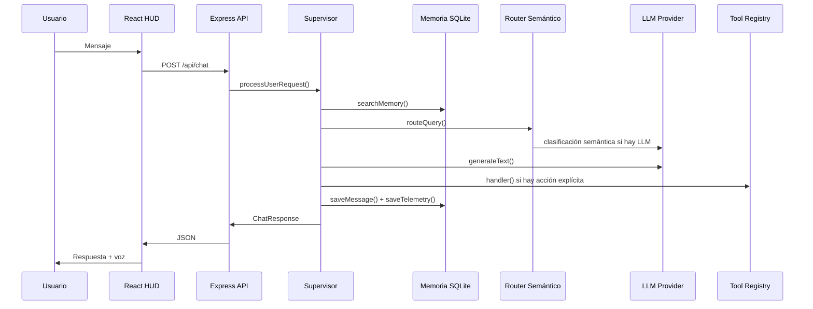

# ALFRED — Documento Técnico Exhaustivo

## 1. Visión general

ALFRED es un mayordomo digital bilingüe diseñado como un sistema multi-agente supervisado. Su objetivo es servir como interfaz de control central para tareas de desarrollo, negocio, seguridad, documentación, marketing, infraestructura y memoria contextual.

La arquitectura se basa en 4 pilares:

1. **Orquestador Central**
2. **Router Semántico**
3. **Capa de Memoria Compartida**
4. **Gestor de Skills/Herramientas**

## 2. Pilar 1 — Orquestador Central

Archivo: `src/alfred_core/supervisor.ts`

Responsabilidades:

- Recibir solicitudes del usuario.
- Recuperar memoria relevante mediante Minerva.
- Enrutar la tarea al sub-agente correcto.
- Construir el prompt de sistema con personalidad estricta.
- Invocar el proveedor LLM disponible.
- Ejecutar herramientas reales cuando corresponde.
- Guardar mensajes y telemetría en SQLite.
- Devolver respuesta estructurada al frontend.

Flujo:

## 3. Pilar 2 — Router Semántico

Archivo: `src/alfred_core/router.ts`

El router intenta clasificar por significado, no solo por coincidencia de palabras.

Estrategia:

1. Si existe LLM configurado (`GEMINI_API_KEY`, `OPENAI_API_KEY`, `OPENROUTER_API_KEY`), se le entrega el catálogo de agentes y se solicita un JSON con `agentId`, `confidence` y `reasoning`.
2. Si no hay LLM o falla, usa fallback determinista por keywords.

Esto permite que ALFRED funcione offline y siga siendo útil.

## 4. Pilar 3 — Memoria Compartida

Archivo: `src/alfred_core/memory.ts`

Persistencia: SQLite con `better-sqlite3`.

Tablas:

- `messages` — historial completo por sesión.
- `memory_records` — memoria episódica/semántica/factual.
- `telemetry` — logs de ejecución.

Búsqueda semántica:

- Usa embeddings ligeros locales tipo hashing bag-of-words.
- No requiere API externa.
- Se puede reemplazar por embeddings OpenAI/Gemini si se desea.

Ventaja: la memoria funciona aunque no haya internet ni claves de IA.

## 5. Pilar 4 — Gestor de Skills

Archivo: `src/skills/toolRegistry.ts`

Cada tool tiene:

- ID estable.
- Agente propietario.
- Nivel de riesgo.
- Schema de parámetros.
- Handler real.

Regla de seguridad: ALFRED no afirma haber ejecutado una acción si el handler no la ejecutó realmente. Si requiere credenciales, hardware, URL o entorno externo, lo informa explícitamente.

## 6. Personalidad y protocolo

Archivo: `src/alfred_core/personality.ts`

Reglas centrales:

- El usuario siempre es **Jefe Maestro**.
- Al delegar se menciona el nombre propio del agente, no códigos.
- Confirmaciones alternan `Comprendido, Jefe Maestro` / `Entendido, Jefe Maestro`.
- Sin emojis.
- Sin listas no solicitadas.
- Sin acciones inventadas.

## 7. Proveedor LLM

Archivo: `src/alfred_core/llmProvider.ts`

Soporta:

- Gemini
- OpenAI
- OpenRouter
- Offline fallback

Esto desacopla el core del proveedor específico.

## 8. Frontend HUD

Stack:

- React 19
- Vite 6
- Tailwind v4
- lucide-react
- d3

Sistema visual:

- Paleta Aether-Chassis: void, cyan, purple, magenta, gold.
- Glassmorphism.
- Bordes con glow.
- Corners chamfered/octogonales.
- Tipografía: Playfair Display + JetBrains Mono.

Componentes principales:

- `HeaderHUD`
- `AlfredCoreHUD`
- `SubAgentsGrid`
- `ToolsEngine`
- `PoliciesGuardrails`
- `ObservabilityDashboard`
- `NeuralNetworkMap`
- `DocsArchitecture`

## 9. API

Endpoints:

| Endpoint | Método | Descripción |
|---|---|---|
| `/api/health` | GET | Estado del core |
| `/api/agents` | GET | Lista de sub-agentes |
| `/api/tools` | GET | Catálogo de herramientas |
| `/api/policies` | GET | Políticas de seguridad |
| `/api/telemetry` | GET | Métricas y logs |
| `/api/history/:sessionId` | GET | Historial persistente |
| `/api/chat` | POST | Chat principal |
| `/api/tts` | POST | Síntesis de voz |

## 10. Seguridad

Políticas incluidas:

- Protección de datos personales.
- Confirmación humana para comandos críticos.
- Rate limiting conceptual.
- Trazabilidad inmutable.
- Prohibición de acciones ficticias.

## 11. Estado verificado

El proyecto fue compilado y ejecutado en producción. Se verificó:

- TypeScript sin errores.
- Build Vite correcto.
- Servidor producción en línea.
- 12 agentes cargados.
- Chat enruta correctamente a Thomas y Fortress.
- SQLite persiste mensajes.
- Telemetría retorna métricas reales.
